# 🥚 Egg Shell Defect Detection System

## 📑 Table of Contents

- [Project Overview](#-project-overview)
- [Core Features](#-core-features)
- [Mobile Application](#-mobile-application)
- [AI Model Performance](#-ai-model-performance)
- [System Architecture](#-system-architecture)
- [Technologies Used](#️-technologies-used)
- [Source Code Availability](#-source-code-availability)
- [Future Improvements](#-future-improvements)

An AI-powered egg shell defect detection system developed using Flutter, ESP32-CAM, TensorFlow Lite and Edge Impulse.

The application captures egg images using an ESP32-CAM module and performs on-device AI inference to classify eggs as **Cracked** or **Healthy**.

Besides AI inference, the application also provides LED brightness control, stepper motor control, image management, statistics dashboard and automation features.

> **Note:** This repository showcases the project architecture, mobile application and AI performance. The complete source code, trained models and datasets are maintained in a private repository.

---

# ✨ Core Features

## 🤖 Artificial Intelligence

- Egg shell defect classification
- TensorFlow Lite inference
- Edge Impulse Transfer Learning
- On-device prediction
- Confusion Matrix
- Precision, Recall and F1 Score evaluation

## 📱 Mobile Application

- Live ESP32-CAM stream
- Camera page
- AI prediction
- Smart gallery
- Statistics dashboard
- Settings panel

## ⚙️ Embedded Hardware

- ESP32-CAM
- Adjustable LED brightness
- 360° Stepper motor control
- Wi-Fi communication
- Automatic image capture

## 📂 Dataset Management

- Image history
- Prediction history
- Automatic storage
- Organized image gallery

---

# 📱 Mobile Application

The Flutter application manages hardware communication, image acquisition, AI inference and visualization of prediction results.

<table>

<tr>

<td align="center">
<b>🏠 Home Dashboard</b>  
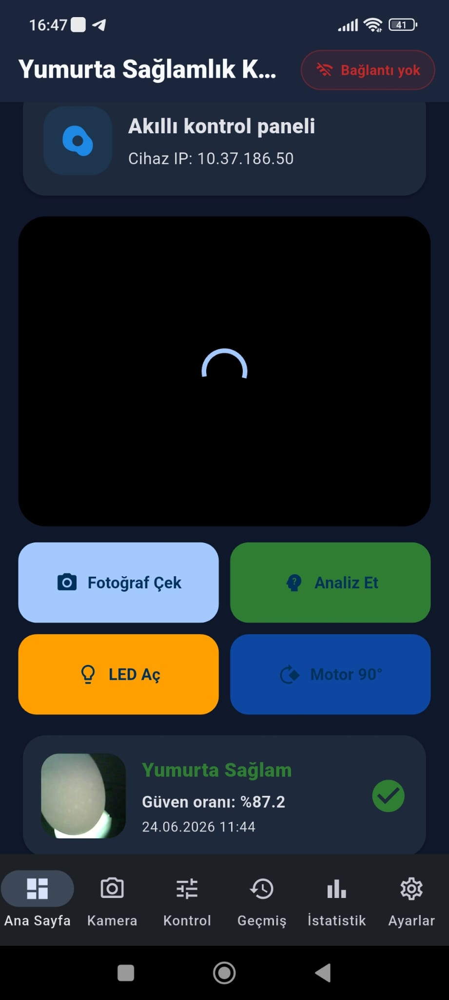
</td>

<td align="center">
<b>📷 Camera & AI Analysis</b>  
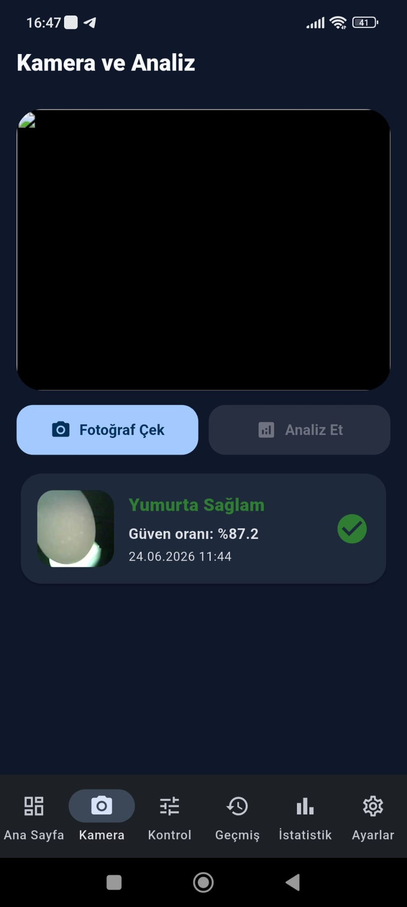
</td>

<td align="center">
<b>⚙️ Manual Hardware Control</b>  
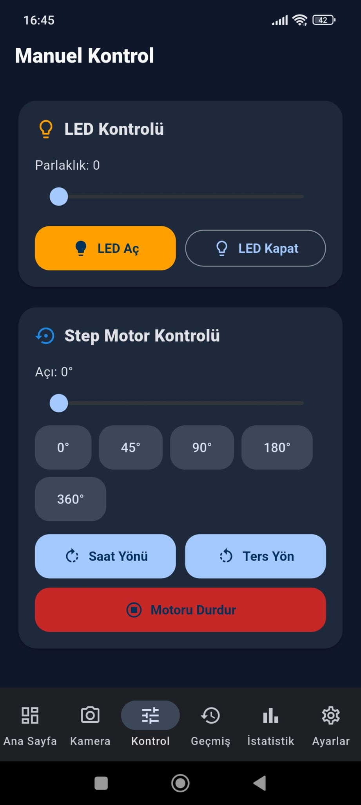
</td>

</tr>

<tr>

<td align="center">
<b>🗂️ Analysis History</b>  
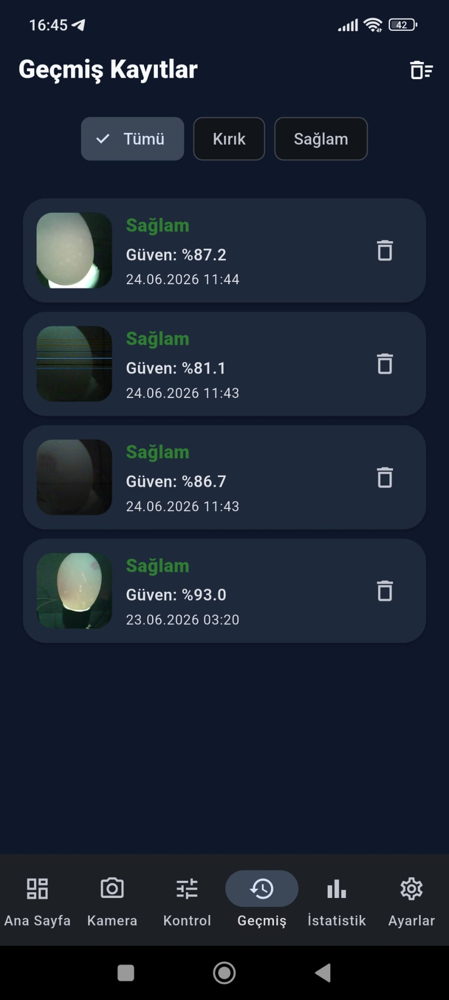
</td>

<td align="center">
<b>📊 Statistics Dashboard</b>  
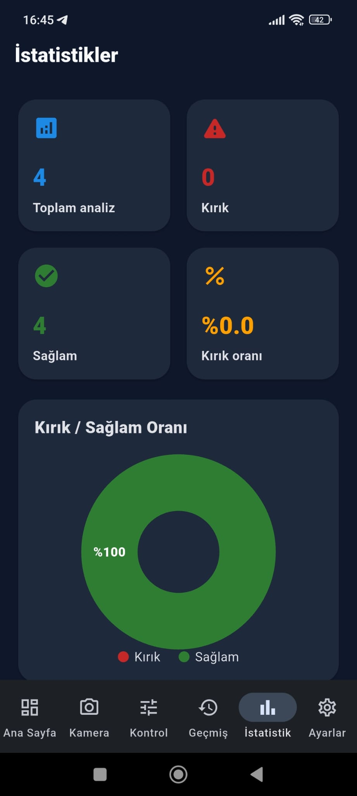
</td>

<td align="center">
<b>🌐 ESP32 Settings</b>  
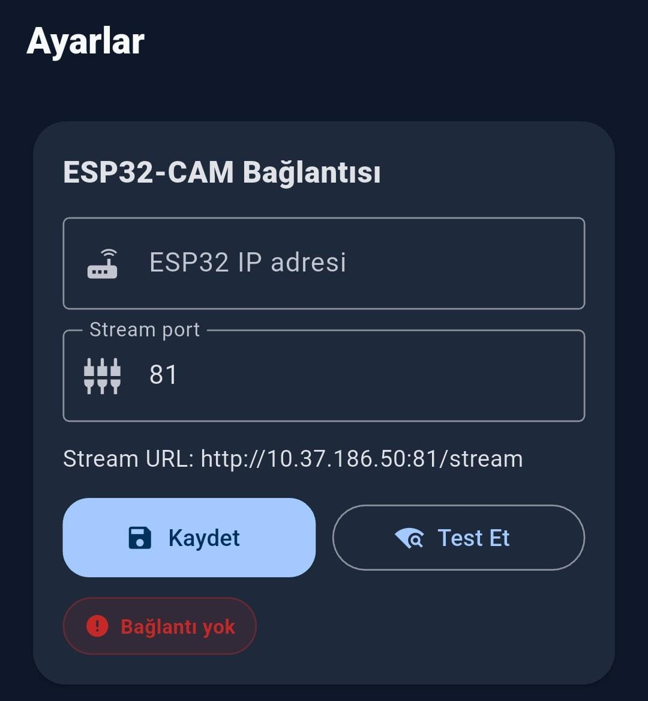
</td>

</tr>

</table>

### ✨ Key Capabilities

- 📷 Live ESP32-CAM stream
- 🧠 Local TensorFlow Lite inference
- ⚡ Real-time crack detection
- 💡 Adjustable LED brightness
- ⚙️ Stepper motor control
- 📂 Analysis history
- 📊 Statistics dashboard
- 🌐 ESP32 connection settings

---

# 🧠 AI Model Performance

The egg shell defect detection model was trained using Edge Impulse Transfer Learning and exported as a TensorFlow Lite model for deployment inside the Flutter application.

Inference is performed completely offline on the mobile device.

<table>

<tr>

<td align="center">

<b>📊 Transfer Learning</b>  

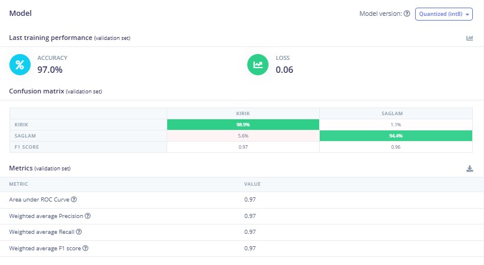

</td>

<td align="center">

<b>✅ Model Testing</b>  

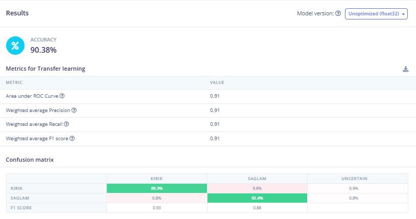

</td>

</tr>

<tr>

<td align="center">

<b>📈 Feature Explorer</b>  

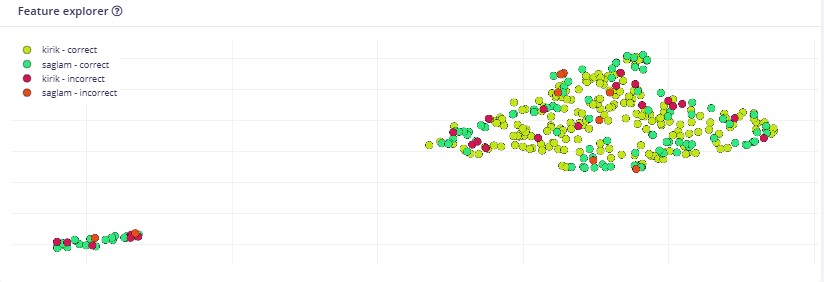

</td>

<td align="center">

<b>📉 Data Explorer</b>  

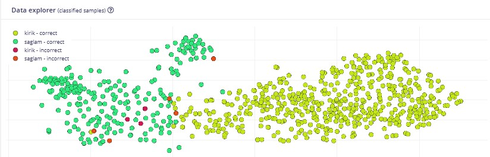

</td>

</tr>

</table>

---

## 📋 Performance Summary

| Metric | Value |
|---------|------:|
| Validation Accuracy | **97.0%** |
| Model Testing Accuracy | **90.38%** |
| Validation Precision | **0.97** |
| Validation Recall | **0.97** |
| Validation F1 Score | **0.97** |
| Test Precision | **0.91** |
| Test Recall | **0.91** |
| Test F1 Score | **0.91** |
| Deployment | **TensorFlow Lite** |

---

### 🚀 Highlights

- Transfer Learning based image classification
- TensorFlow Lite deployment
- Offline AI inference
- Crack detection in real time
- Feature visualization
- Dataset validation

---

# 🏗️ System Architecture

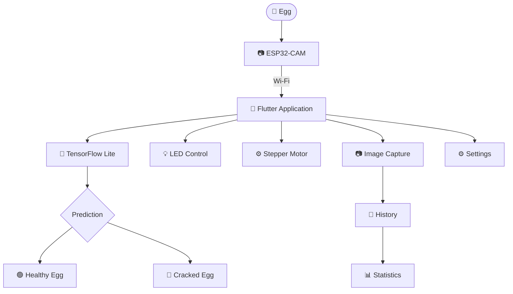

---

# 🛠️ Technologies Used

| Category | Technology |
|----------|------------|
| Mobile Framework | Flutter |
| Programming Language | Dart |
| AI Framework | TensorFlow Lite |
| AI Development | Edge Impulse |
| Hardware | ESP32-CAM |
| Communication | Wi-Fi |
| Computer Vision | Image Classification |
| Embedded Control | Stepper Motor & LED |

---

# 🔒 Source Code Availability

This repository presents the application's architecture, AI workflow, mobile interface and model evaluation.

The complete Flutter source code, ESP32 firmware, TensorFlow Lite model and dataset are maintained in a private repository to protect the project's intellectual property.

For research collaboration, commercial licensing or a live demonstration, feel free to contact me.

---

# 🚀 Future Improvements

- Multi-class defect detection
- Automatic dataset expansion
- Cloud synchronization
- Remote monitoring
- Explainable AI visualization
- OTA firmware updates
- Performance optimization
